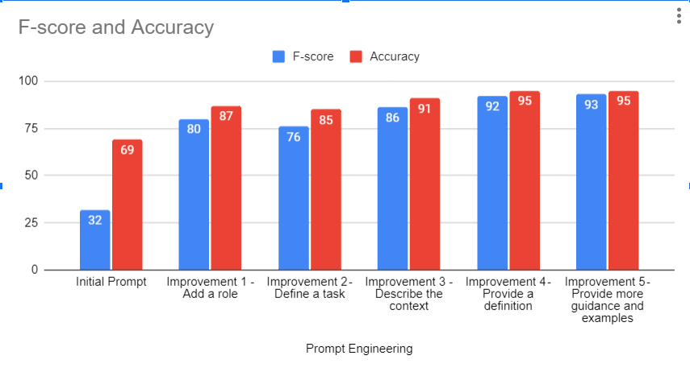

# Increase Predictions by 50% with Smart Prompting


[](https://medium.com/@yennhi95zz/subscribe)
[](https://github.com/yennhi95zz)
[](https://www.kaggle.com/nhiyen/code)
[](https://www.linkedin.com/in/yennhi95zz/)
[](https://www.upwork.com/freelancers/~018cb35a4fd005fbff)

This notebook is associated with the articles/ project below:

- Find the full code on this [GitHub repository](https://github.com/yennhi95zz/llm-prompt-engineering).
- Explore a detailed explanation in my [Medium article](https://medium.com/@yennhi95zz/increase-predictions-by-50-with-smart-prompting-981385fb10af).

👉Get UNLIMITED access to every story on Medium with just $1/week ▶ [HERE](https://medium.com/@yennhi95zz/membership)

👉Troubling with LLM? Hire me in [Upwork](https://medium.com/r/?url=https%3A%2F%2Fwww.upwork.com%2Ffreelancers%2F~018cb35a4fd005fbff).

## I. What is Prompt Engineering?
Prompt engineering is the process of structuring an instruction that can be interpreted and understood by a generative AI model. A prompt is natural language text describing the task that an AI should perform. (Source: Wikipedia)

Using Prompt Engineering techniques properly can optimize model performance, reduce costs, and save effort. While the model may not excel at all tasks initially, results can be improved with proper guidance. Adjusting prompts provides quicker feedback compared to fine-tuning, which requires creating datasets and running training jobs.

## II. Prompt Engineering: Step by Step Guide
### 1. Dataset
The data used in this project is a subset of the [Sentiment Labelled Sentences Data Set](https://www.kaggle.com/datasets/marklvl/sentiment-labelled-sentences-data-set), containing sentences labeled with positive or negative sentiment. Analyzing this sentiment offers deeper insights into customer feedback.

### 2. Statistics Method
To measure the efficiency of prompts, we use metrics like Accuracy and F-score.


### 3. Let's Start the Experiment
#### 3.0. Define the Scope
Using LLM, we aim to classify whether customer feedback expresses anger or not. The LLM bot will answer Yes/No based on the provided prompt.

We expect the LLM bot to achieve high accuracy compared to the truth expressed in original messages. Our goal is an F-score of 90% and Accuracy of 95%.

#### 3.1. Prerequisites
- Obtain your OpenAI API keys: [OpenAI Help Center](https://help.openai.com/en/articles/5514112-where-can-i-find-my-api-key)
- Install the required Python libraries listed in `requirements.txt`.

#### 3.2. Initial Prompt Template
```python
template = """Is the sentence in the backticks below about anger? Answer only "yes" or "no".
            ```{sentence}```
        """

prompt = PromptTemplate.from_template(template)
```
#### 3.3. Apply Prompt Engineering Techniques

- Improvement 1: Add context
- Improvement 2: Define specific tasks
- Improvement 3: Provide detailed examples
- Improvement 4: Include definitions
- Improvement 5: Refine guidance and examples

#### 3.4. Final Result

By applying these prompt engineering techniques, we achieved a significant improvement: F-score increased by **61%** (from 32% to 93%) and Accuracy by **26%** (from 69% to 95%). We have met our target (F-score ≥ 90%, Accuracy ≥ 95%).



*Question: Can we achieve scores closer to 100%?* Prompt engineering involves advanced techniques for training models on extensive datasets, not just adding parameters.

👉 Read more about [Advanced Prompt Engineering Techniques](https://medium.com/r/?url=https%3A%2F%2Fwww.upwork.com%2Ffreelancers%2F~018cb35a4fd005fbff%3Fp%3D1800734980118216704):

## III. Contribution

If you have improvements or new methods to add, follow these steps:

1. **Fork the Repository**: Click "Fork" to create a copy in your GitHub account.
2. **Clone the Forked Repository**: Use `git clone` to get a local copy.
3. **Create a New Branch**: Make a new branch for your changes.
4. **Make Changes**: Add or modify code, documentation, etc.
5. **Commit Changes**: Commit with a clear message.
6. **Push Changes**: Push to your forked repo.
7. **Create a Pull Request (PR)**: Open a PR from your branch to the main repo.

Feel free to contribute and make this project even better!

## IV. License

This project is licensed under the [MIT License](https://github.com/git/git-scm.com/blob/main/MIT-LICENSE.txt), making it open for collaboration and use in various projects.